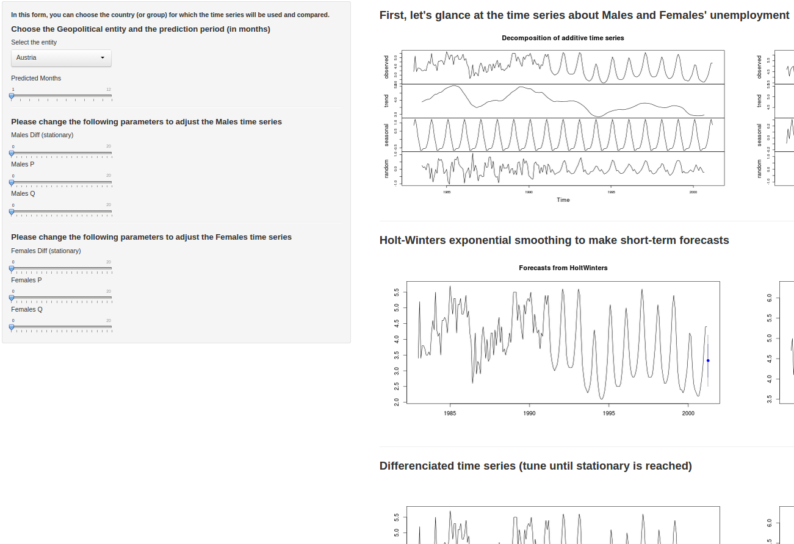

Unemployment: the sad and even sadder facts about it
========================================================
author: dk-lisa


## An app showing the unemployment crisis and discrepancy between Males and Females!

The app's internals
========================================================
Available [online](https://noootsab.shinyapps.io/devdataprod-noootsab/), the application we'll talk about has
been:
 * created using [RStudio's Shiny](http://shiny.rstudio.com/) and 
 * published on the helpful hosting service [shinyapps.io](http://www.shinyapps.io).


Data
========================================================
Time series datasets on unemployment available from [datamarket.com](http://datamarket.com).


To ease the integration, data market is distributing a R package, `rdatamarket`. Installing it, gives access to:
 * `dminfo`: metadata of a dataset by id.
 * `dmlist`: fetch data by id.

```r
u <- dminfo("19rf")
u$title
```

```
[1] "Harmonised unemployment rates (%) - monthly data"
```


Unemployment by geopolitical entity
========================================================
However, the time series has been split by gender. 

This to also illustrate how female employments sadly suffers the crisis more.

 

Predict the unemployment
========================================================
Three ways:
 * `HoltWinters`: very simple exponential smoothing
 * auto __ARIMA__: `auto.arima` (from library `forecast`)
 * tunable `ARIMA`: sliders for p, d and q -- [see](http://en.wikipedia.org/wiki/Autoregressive_integrated_moving_average))



